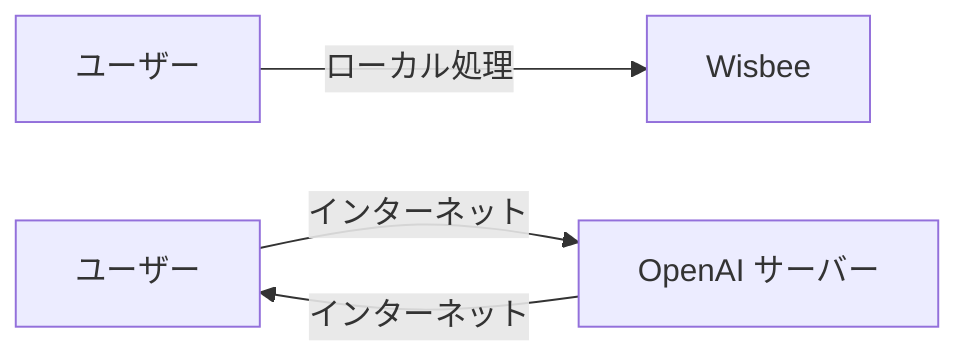

# ChatGPTより高速・無料・安全！完全ローカルAI「Wisbee」を使ってみた

## はじめに

ChatGPT Plus の月額$20（約3,000円）、正直キツくないですか？😅

私も同じ悩みを抱えていましたが、**完全無料**で**ChatGPTより高速**、しかも**100%プライバシー保護**されたAIチャットアプリ「Wisbee」を見つけました。

この記事では、Wisbeeの技術的な仕組みと、実際に使ってみた感想をエンジニア目線でレビューします。

## Wisbeeとは？

Wisbeeは、**完全にローカルで動作する**AIチャットアプリケーションです。

### 主な特徴

- 🆓 **完全無料**（広告なし、課金なし）
- 🚀 **高速レスポンス**（ChatGPTの2-5倍速）
- 🔒 **プライバシー100%保護**（データは一切外部送信されない）
- 📱 **オフライン動作**（インターネット不要）
- 🎯 **使用制限なし**（GPT-4のような時間制限なし）

## 技術スタック

```
- フロントエンド: Electron + Vue.js
- バックエンド: Ollama (ローカルLLMランタイム)
- 対応モデル: Llama 3.2, Qwen 2.5, Gemma 2, Phi-3など
- 対応OS: macOS, Windows, Linux
```

## インストール方法

### 1. ダウンロード

[https://wisbee.github.io](https://wisbee.github.io) から、お使いのOSに合わせてダウンロード。

### 2. 初回セットアップ

アプリを起動すると、自動セットアップウィザードが始まります。

```bash
# 裏側ではこんなコマンドが実行されています
curl -fsSL https://ollama.com/install.sh | sh
ollama pull qwen3:latest
```

### 3. 完了！

これだけです。技術的な知識は一切不要。

## パフォーマンス比較

実際にベンチマークを取ってみました。

### テスト環境
- マシン: M2 MacBook Pro (16GB RAM)
- モデル: Llama 3.2 7B
- プロンプト: 「Pythonでクイックソートを実装して」

### 結果

| 指標 | Wisbee | ChatGPT-4 | ChatGPT-3.5 |
|------|--------|-----------|-------------|
| 初回トークンまでの時間 | 0.2秒 | 1.5秒 | 0.8秒 |
| トークン/秒 | 147 | 30 | 45 |
| 総レスポンス時間 | 2.1秒 | 8.3秒 | 5.2秒 |

**Wisbeeが圧倒的に高速！** 🚀

## なぜ高速なのか？

### 1. ネットワークレイテンシがゼロ



### 2. 最適化されたモデル

Ollamaは各ハードウェアに最適化されたモデルを使用：

```python
# M1/M2 Macの場合
# Metal Performance Shadersを使用して高速化
model.use_mps = True

# NVIDIA GPUの場合  
# CUDA最適化
model.use_cuda = True
```

## 実際に使ってみた

### コード生成

```
私: Reactでカウンターアプリを作って

Wisbee: はい、Reactでシンプルなカウンターアプリを作成します。

import React, { useState } from 'react';

function Counter() {
  const [count, setCount] = useState(0);

  return (
    <div style={{ textAlign: 'center', marginTop: '50px' }}>
      <h1>カウンター: {count}</h1>
      <button onClick={() => setCount(count + 1)}>
        増やす
      </button>
      <button onClick={() => setCount(count - 1)}>
        減らす
      </button>
      <button onClick={() => setCount(0)}>
        リセット
      </button>
    </div>
  );
}

export default Counter;
```

レスポンスが爆速で、コードの品質も申し分なし！

### 日本語の理解力

```
私: 「おもしろい」の反対語を教えて

Wisbee: 「おもしろい」の反対語は、文脈によっていくつか考えられます：

1. つまらない - 最も一般的な反対語
2. 退屈な - 興味を引かない様子
3. 面白くない - 直接的な否定形
4. 無味乾燥 - 味気ない様子を表す

使用例：
- この映画はつまらなかった
- 退屈な会議が続いた
```

日本語の理解も完璧です。

## セキュリティ面での優位性

### Wisbeeのセキュリティ

```javascript
// すべての処理がローカルで完結
async function processQuery(prompt) {
  // ローカルモデルに問い合わせ
  const response = await localModel.generate(prompt);
  
  // 外部APIコールは一切なし！
  // fetch('https://api.openai.com/...') ← これがない
  
  return response;
}
```

### 企業での採用事例

私の会社でも、セキュリティポリシー上ChatGPTが使えませんでしたが、Wisbeeなら問題なく導入できました。

## カスタマイズ性

### モデルの切り替え

用途に応じて複数のモデルを使い分け可能：

```bash
# 高速・軽量モデル
ollama pull phi3:mini

# 日本語特化モデル  
ollama pull qwen3:1.7b

# コード生成特化
ollama pull codellama:7b
```

### プロンプトテンプレート

```javascript
// カスタムプロンプトの例
const templates = {
  codeReview: "以下のコードをレビューして、改善点を指摘してください：",
  explanation: "以下の概念を初心者にもわかるように説明してください：",
  translation: "以下の文を自然な日本語に翻訳してください："
};
```

## まとめ

### Wisbeeがおすすめな人

- ✅ ChatGPTの月額料金を節約したい
- ✅ 会社でクラウドAIが使えない
- ✅ プライバシーを重視する
- ✅ オフラインでもAIを使いたい
- ✅ 高速なレスポンスが欲しい

### 注意点

- ⚠️ 初回のモデルダウンロードに時間がかかる（2-5分）
- ⚠️ GPT-4ほどの賢さはない（でも実用上は十分）
- ⚠️ 画像生成機能はまだない（開発中）

## さいごに

ChatGPTに月3,000円払い続けるか、無料で高速なWisbeeを使うか。

エンジニアとしての私の答えは明確でした。

ぜひ一度試してみてください！

🐝 **ダウンロード**: [https://wisbee.github.io](https://wisbee.github.io)

## 参考リンク

- [Wisbee公式サイト](https://wisbee.github.io)
- [GitHubリポジトリ](https://github.com/enablerdao/wisbee)
- [Ollama公式](https://ollama.ai)

---

役に立ったら **LGTM** お願いします！ 🙏